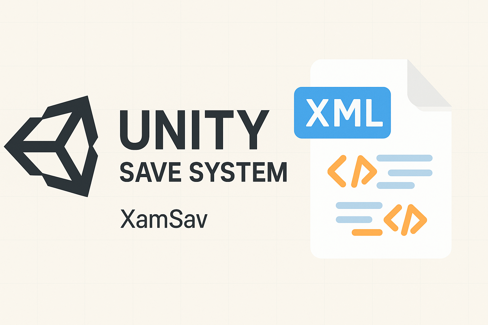

# Unity Save System (.dll para Guardado de Partida)

Este proyecto es una utilidad simple desarrollada en C# con **Visual Studio Community**, diseñada para integrarse como una **librería (.dll)** en proyectos realizados con **Unity Engine**. Su función principal es permitir el **guardado y carga de partidas**, almacenando la información esencial de los `GameObject` de una escena, como su posición y componentes.

## Características

- Serialización de objetos en formato **XML**.
- Guarda la posición y los componentes de cada `GameObject` raíz en la escena.
- Permite cargar la posición guardada de un `GameObject` específico.
- Se puede reutilizar como **librería externa (.dll)** para cualquier proyecto Unity compatible.

## Estructura del Proyecto

El código está encapsulado en la clase `MyUtils` dentro del espacio de nombres `Utils`, e incluye las siguientes funciones clave:

- `CreateXML()`  
  Escanea todos los `GameObject` de la escena activa y guarda su información en un archivo XML (`MiPrimerXML.xml`).

- `CreateXML2(GameObject[] Player)`  
  Método auxiliar para escribir los datos en el XML.

- `Load(GameObject jugador)`  
  Carga los datos de posición desde el XML y los aplica al `GameObject` especificado.

- `GameObjectSave(GameObject Player, Scene scene)`  
  (Actualmente no implementado, reservado para posibles expansiones.)

## Cómo usar

1. Compila el proyecto en Visual Studio para generar el archivo `.dll`.
2. Importa el `.dll` en tu proyecto de Unity (colócalo en la carpeta `Assets/Plugins` o similar).
3. Llama a los métodos de la clase `MyUtils` desde tu código en Unity para guardar o cargar partidas.

### Ejemplo de uso en Unity

```csharp
using Utils;
using UnityEngine;

public class GameSaver : MonoBehaviour
{
    MyUtils utils = new MyUtils();

    void SaveGame()
    {
        utils.CreateXML();
    }

    void LoadGame()
    {
        utils.Load(this.gameObject); // Carga la posición de este GameObject
    }
}
